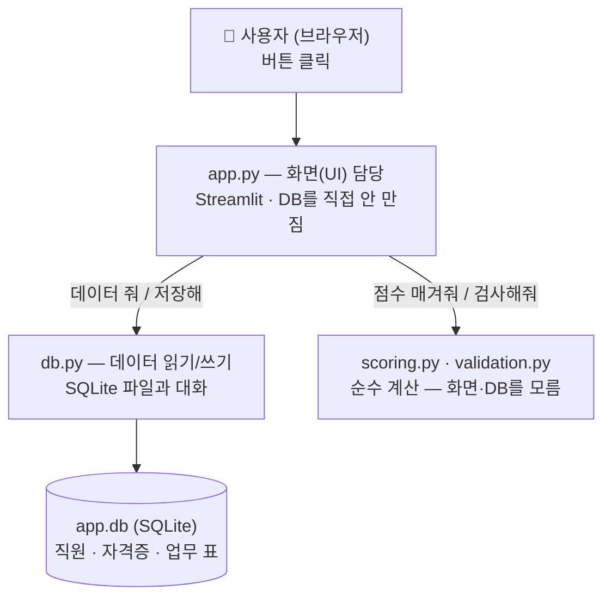
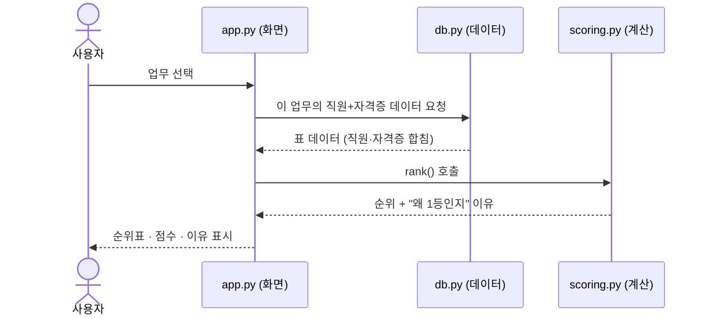
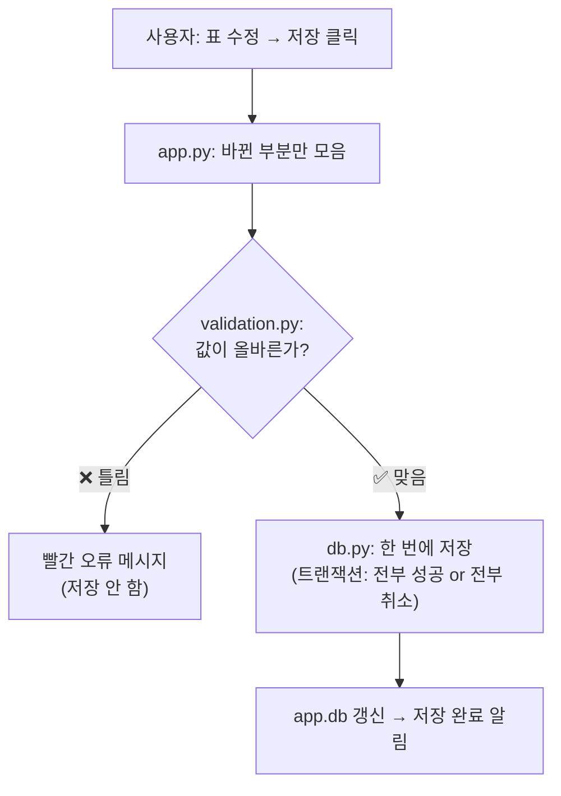
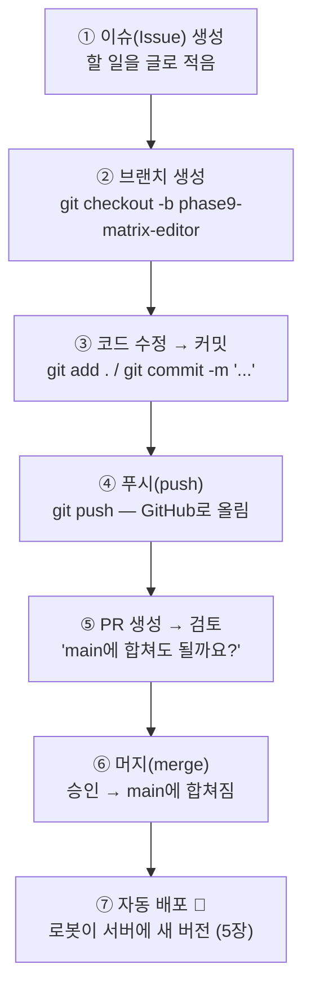
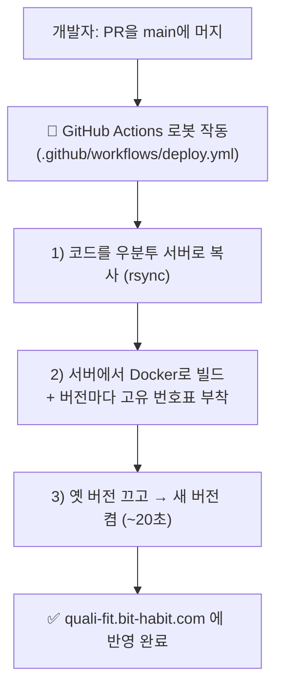
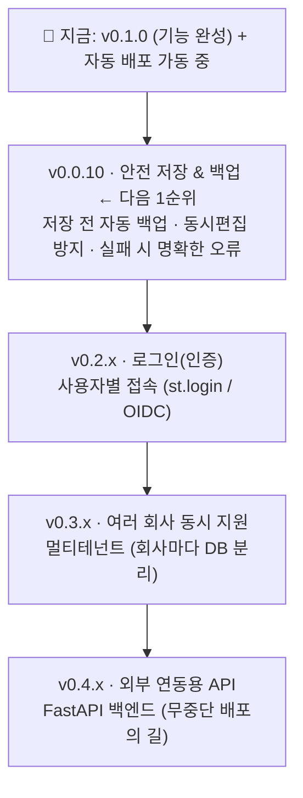

# 프로젝트 소개 & 개발 입문 — quali-fit

> 이 문서는 **개발을 이제 막 시작하는 분**을 위한 입문서입니다.
> 어려운 용어는 나올 때마다 **(괄호로 풀이)** 하고, 그림으로 흐름을 보여 줍니다.
> 깊은 기술 문서(영문)는 [README.md](README.md)에 따로 있습니다.
>
> **읽는 순서 추천:** 1·2장(이게 뭔지) → 3장(어떻게 만들어졌나) → 4장(GitHub 기초) → 5장(배포) → 6·7장(버전·계획)

---

## 1) 30초 만에 이해하기 🟢

**한 줄 요약:**
> "이 업무에는 **어떤 직원**을 투입하면 좋을까?"를 **자격증 기준으로 점수 매겨 추천**해 주고,
> **왜 그 사람인지 이유까지** 보여 주는 사내 웹 도구입니다.

**왜 필요한가요?**
회사가 프로젝트를 수주할 때 제안서에 *"이 일은 이런 사람들로 한다"*를 **근거와 함께** 적어야 합니다.
예전엔 사람이 엑셀을 뒤져 손으로 했어요. 이 도구는 그걸 **자동으로, 이유를 붙여서** 해 줍니다.

**비유:** 채용 매칭 사이트처럼 — *"이 일엔 이 자격증이 중요한데, 김OO 씨가 그걸 가져서 1순위"* 라고 **순위 + 설명**을 뽑아 줍니다.

---

## 2) 5분 만에 이해하기 🟡

### 무엇으로 추천하나요? — 재료 3가지

| 재료 | 내용 | 규모(현재) |
|---|---|---|
| 👤 **직원** | 누가 어떤 자격증을 가졌는지 | 약 40명 |
| 📋 **업무분류** | 어떤 종류의 일이 있는지 | 수십 종 |
| 🔗 **매핑(연결표)** | "어떤 자격증이 어떤 업무에 얼마나 중요한가"를 **1~5점**으로 매긴 표 | 수백 개 연결 |

### 점수는 어떻게 나오나요? (아주 쉽게)

- 자격증 하나의 기여도 = **중요도(1~5점)** × (**유효하면 1, 만료됐으면 0**)
  → 즉 **만료된 자격증은 점수에 안 들어갑니다.**
- 한 직원의 총점 = **가장 중요한 자격증 1개** + **나머지 자격증 보너스**(조금씩, 최대 +2점)

> **예시:** 어떤 업무에 '자격증 A(중요도 5)'가 핵심이면, A를 가진 직원이 기본 5점.
> 관련 자격증을 더 가지면 보너스가 조금 붙되, **상한이 있어서 "자격증만 많은 사람"이 "딱 맞는 전문가"를 이기지 못합니다.**

점수 옆엔 항상 **"왜 이 점수인지"**가 표시됩니다. **숫자만 던지지 않고 근거를 보여 주는 것**이 핵심이에요.

### 화면은 2개뿐 (이게 프로그램의 두 가지 "모드")

1. **데이터 관리**(`manage`) — 직원·자격증·업무 정보를 입력/수정
2. **직원 추천**(`recommend`) — 업무를 고르면 적합한 직원 순위 + 이유

### 어디서 쓰나요?
- 브라우저로 `https://quali-fit.bit-habit.com` 접속 → **아이디/비밀번호** 입력
- 설치할 프로그램 없음. **브라우저만 있으면 됩니다.**

---

## 3) 개발자의 눈으로 보기 🔵 (입문)

여기서부터는 **"이게 어떻게 만들어졌나"**를 봅니다. 개발 공부의 출발점입니다.

### 3-1. 전체 구조 한 장으로

이 프로그램은 **역할별로 층(레이어)**이 나뉘어 있습니다. 각 층은 자기 일만 합니다.



**왜 이렇게 층을 나눌까요?** (입문자가 꼭 알면 좋은 개념)
- 한 파일이 모든 걸 다 하면, 나중에 고치기 어렵고 실수가 잦습니다.
- 그래서 **"화면(app.py)"**, **"데이터(db.py)"**, **"순수 계산(scoring/validation)"**을 분리했습니다.
- 규칙: `app.py`엔 SQL(데이터베이스 명령)이 없고, `db.py`엔 화면 코드가 없습니다. → **나중에 화면을 다른 걸로 바꿔도 데이터·계산 코드는 그대로 재사용** 가능.

### 3-2. 폴더/파일 지도

```
원가용역_직원_추천_claude/
│
├── app.py            ← 화면 전체 (모드 2개: 데이터 관리 / 직원 추천)
├── db.py             ← 데이터 읽기/쓰기 (SQLite)
├── scoring.py        ← 점수 계산 (순수 함수, 핵심: rank())
├── validation.py     ← 입력값 검사 (저장 전에 막기, 핵심: validate_diff())
├── requirements.txt  ← 이 프로그램이 필요로 하는 외부 라이브러리 목록
│
├── Data/             ← 예시(가짜) 데이터 CSV + 백업 폴더
├── app.db            ← 실제 데이터 파일 (개인용, GitHub엔 안 올라감)
│
├── Dockerfile        ← "프로그램을 통째로 상자에 담는 법"(컨테이너) 설명서
├── k8s/              ← 서버에서 어떻게 띄울지(쿠버네티스) 설정들
├── scripts/          ← 배포·데이터적재 등 자동화 스크립트(deploy.sh 등)
└── .github/workflows/deploy.yml  ← "자동 배포 로봇"의 행동 지침서
```

> 💡 입문 팁: 처음엔 **`app.py` → `db.py` → `scoring.py`** 순서로만 읽어도 프로그램의 80%가 이해됩니다.

### 3-3. 사용자가 버튼을 누르면 무슨 일이? (요청 흐름)

**[직원 추천] 화면에서 업무를 하나 고르면:**



**[데이터 관리] 화면에서 표를 고치고 저장하면:**



> "한 번에 전부 성공 or 전부 취소"를 **트랜잭션(transaction)**이라고 합니다.
> 중간까지만 저장돼서 데이터가 반쪽이 되는 사고를 막아 줍니다.

### 3-4. 데이터 저장과 안전장치
- 모든 정보는 서버의 **작은 파일 DB**(`app.db`, SQLite) 1개에 있습니다. (이 규모엔 거대한 DB 서버보다 이게 딱 맞음 — 일부러 고른 선택)
- 프로그램을 새 버전으로 바꿔도 이 파일은 **별도 보관 공간**에 있어 **데이터는 유지**됩니다.
- 안전장치: 자격증 **만료 자동 반영** · 저장 실패 시 **전부 취소(롤백)** · 잘못된 값은 **저장 전에 차단**.

> 💡 **개인정보:** 공개 코드엔 **실제 이름·실제 회사 데이터가 전혀 없습니다.** 전부 가짜(합성) 샘플이고, 진짜 데이터는 코드와 분리된 곳에만 둡니다.

---

## 4) GitHub 사용법 입문 (commit이 뭔지부터) 🐙

개발은 **코드(글자로 된 설계도)를 계속 고치는 일**입니다. 그 변경을 안전하게 기록·공유하는 도구가 Git/GitHub예요.

### 4-1. Git vs GitHub — 한 문장 정리
- **Git** = 내 컴퓨터에서 코드 변경을 기록하는 **"타임머신/세이브 기능"**.
- **GitHub** = 그 기록을 **인터넷에 보관하고 여럿이 함께 쓰는 곳** (구글 드라이브의 코드 버전).

### 4-2. 꼭 아는 단어 5개

| 단어 | 쉽게 말하면 | 게임에 비유 |
|---|---|---|
| **commit (커밋)** | "지금까지 고친 걸 **메시지와 함께 저장**"한 한 덩어리 | 세이브 포인트 (이름 붙은) |
| **branch (브랜치)** | 본 작업(main)을 안 건드리고 **따로 갈라서** 작업하는 공간 | 평행우주 |
| **push (푸시)** | 내 컴퓨터의 커밋들을 **GitHub(인터넷)로 올림** | 클라우드 업로드 |
| **pull request (PR)** | "내 브랜치 작업을 main에 **합쳐도 될까요?**" 검토 요청 | 합병 신청서 |
| **merge (머지)** | 승인되면 **main에 합침** (그러면 자동 배포까지!) | 평행우주를 본편에 합치기 |

> **main(메인)** = 그 프로젝트의 **"공식 최신 버전"** 가지. 사용자가 보는 서비스는 항상 main 기준으로 배포됩니다.

### 4-3. 이 프로젝트의 작업 흐름 (한 사이클)

이 저장소는 **"한 가지 작업 = 이슈 1개 → 브랜치 1개 → PR 1개"** 규칙으로 굴러갑니다.



### 4-4. 처음 써 보는 명령어 (치트시트)

```bash
# 0. (최초 1회) 저장소를 내 컴퓨터로 복제
git clone https://github.com/bookseal/quali-fit.git

# 1. 새 작업 공간(브랜치) 만들기 — 항상 새 작업은 브랜치부터!
git checkout -b 내-작업이름

# 2. 코드 수정 후, 변경 확인
git status          # 뭐가 바뀌었는지 보기
git diff            # 구체적으로 어떻게 바뀌었는지 보기

# 3. 저장(커밋)
git add .                       # 저장할 변경 고르기 (.은 전부)
git commit -m "무엇을 왜 바꿨는지 한 줄"

# 4. GitHub로 올리기
git push -u origin 내-작업이름

# 5. 그다음은 GitHub 웹사이트에서 'Pull Request' 버튼으로 PR 생성
```

> 💡 입문 팁:
> - **커밋 메시지는 미래의 나에게 쓰는 편지**입니다. "수정함" 말고 "자격증 만료 점수 반영" 처럼 **무엇을 왜** 적으세요.
> - **main에서 직접 작업하지 말고 항상 브랜치를 만드세요.** 실수해도 main(서비스)은 안전합니다.
> - 겁내지 마세요. 커밋은 **세이브 포인트**라, 언제든 되돌릴 수 있습니다.

---

## 5) 자동 배포 — 코드가 어떻게 진짜 서비스가 되나 🤖

이 프로그램은 **우분투(Ubuntu) 서버** 한 대 위에서 돌아갑니다.
개발자가 **main에 머지**하면, **로봇(GitHub Actions)이 알아서 서버에 새 버전을 올립니다.** 사람이 서버에 직접 들어갈 필요가 없어요.



- **이 절차서가 곧 `deploy.yml` 파일**입니다. 개발자가 "이렇게 배포해라"를 적어 두면 로봇이 그대로 따라 합니다.
- **왜 20초 멈추나?** 데이터가 파일 1개라, 두 버전이 동시에 켜지면 꼬일 수 있어서 **일부러 끄고-켭니다.** 내부 도구라 이 정도는 감수한 의도된 선택입니다.

---

## 6) 버전별 업데이트 (지나온 길)

> 규칙: **버전 1개 = 이슈 1개 → 브랜치 → PR → 머지.** "기능을 어떤 순서로 쌓아 올렸나"의 기록입니다.

| 버전 | 무엇이 추가됐나 |
|---|---|
| v0.0.1 | 기본 뼈대 (Streamlit "hello world") |
| v0.0.2 | 데이터베이스 표 설계 + 예시 데이터 넣기 |
| v0.0.3 | 데이터 **조회**(읽기 전용) 화면 |
| v0.0.4 | 직원 표 **편집**(추가/수정/삭제) |
| v0.0.5 | 입력값 **검증**(잘못된 값 막기) |
| v0.0.6 | **모든 표** 편집 + 연결값 드롭다운 선택 |
| v0.0.7 | **점수 추천**(이유 포함) + 관리/추천 모드 |
| v0.0.8 | 화면 **전면 개편** (2단 메뉴, 한글화) |
| v0.0.9 | **매트릭스 에디터** (업무×자격증 점수를 표로 한 번에) ✅ |
| v0.1.0 | 기존 도구와 기능 동등 + 문서화 ✅ |
| **(인프라)** | **배포 자동화 구축** — Docker + 쿠버네티스 + GitHub Actions ✅ *(오늘)* |
| **(안정화)** | 버전별 이미지 번호표, 서버 정리 자동화, 빌드 도구 최신화 ✅ *(오늘)* |

---

## 7) 현재 계획 (앞으로 갈 길)



> **안 할 것도 정해 둠**(과금·자동 회원가입 등). **범위를 좁게 유지하는 것**도 설계의 일부입니다.

---

## 한눈에 정리

| 질문 | 답 |
|---|---|
| 이게 뭐예요? | 업무에 맞는 직원을 **이유와 함께 추천**하는 사내 웹 도구 |
| 코드 구조는? | **화면(app.py) → 데이터(db.py) → 계산(scoring/validation)** 으로 층 분리 |
| 데이터는 어디에? | 서버의 파일 1개 `app.db`(SQLite), 만료체크·롤백·백업으로 보호 |
| 코드는 어떻게 합쳐요? | 브랜치에서 **커밋 → 푸시 → PR → 머지** (4장) |
| 서비스는 어떻게 떠요? | main에 머지하면 **로봇이 우분투 서버에 자동 배포**(`deploy.yml`, 5장) |
| 지금 어디까지? | 추천·편집·자동배포 **가동 중**, 다음은 **백업/안전저장**(7장) |

---

*비개발자·입문 개발자를 위한 소개입니다. 깊은 기술 상세는 [README.md](README.md), 살아있는 진행 현황은 GitHub의 [이슈](../../issues)·[PR](../../pulls)을 보세요.*
